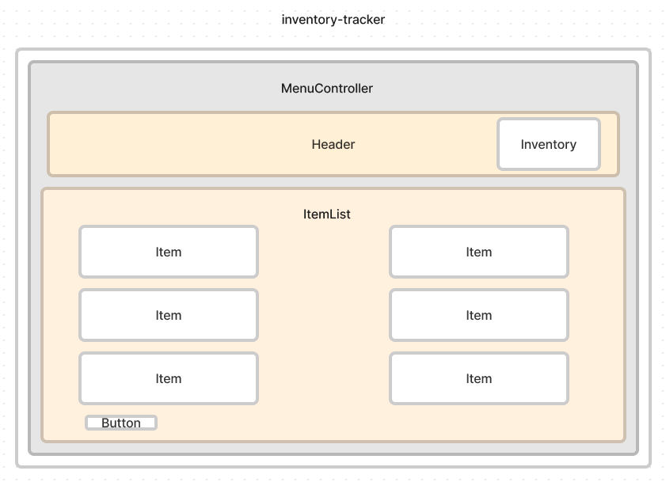

# Inventory Tracker

#### Application will track inventory of coffee beans.

#### By Jennifer Holcomb

## Technologies Used

* React
* Javascript
* HTML
* CSS
* webpack
* Babel
* esLint
* npm
* dotenv

### This application allows a user to track inventory of their coffee beans. User has CRUD capability of bean selection. A widget displays current inventory of all beans. As user buys beans, widget updates to currently available inventory.

## Component Diagram for application

## Setup/Installation Requirements

* Clone this repository to your desktop.
* $ npm install to install all package.
* $ npm run build to build the project.
* $ npm run start to compile the project.
* $ npm run lint to lint JS files in src folder.

## Known Bugs

* "OUT OF STOCK" does not display when inventory is at 0.
* If any issues are discovered, please email jenniferlholcomb@gmail.com.

## License

MIT License

Copyright (c) 2023 Jennifer Holcomb

Permission is hereby granted, free of charge, to any person obtaining a copy of this software and associated documentation files (the "Software"), to deal in the Software without restriction, including without limitation the rights to use, copy, modify, merge, publish, distribute, sublicense, and/or sell copies of the Software, and to permit persons to whom the Software is furnished to do so, subject to the following conditions:

The above copyright notice and this permission notice shall be included in all copies or substantial portions of the Software.

THE SOFTWARE IS PROVIDED "AS IS", WITHOUT WARRANTY OF ANY KIND, EXPRESS OR IMPLIED, INCLUDING BUT NOT LIMITED TO THE WARRANTIES OF MERCHANTABILITY, FITNESS FOR A PARTICULAR PURPOSE AND NONINFRINGEMENT. IN NO EVENT SHALL THE AUTHORS OR COPYRIGHT HOLDERS BE LIABLE FOR ANY CLAIM, DAMAGES OR OTHER LIABILITY, WHETHER IN AN ACTION OF CONTRACT, TORT OR OTHERWISE, ARISING FROM, OUT OF OR IN CONNECTION WITH THE SOFTWARE OR THE USE OR OTHER DEALINGS IN THE SOFTWARE.